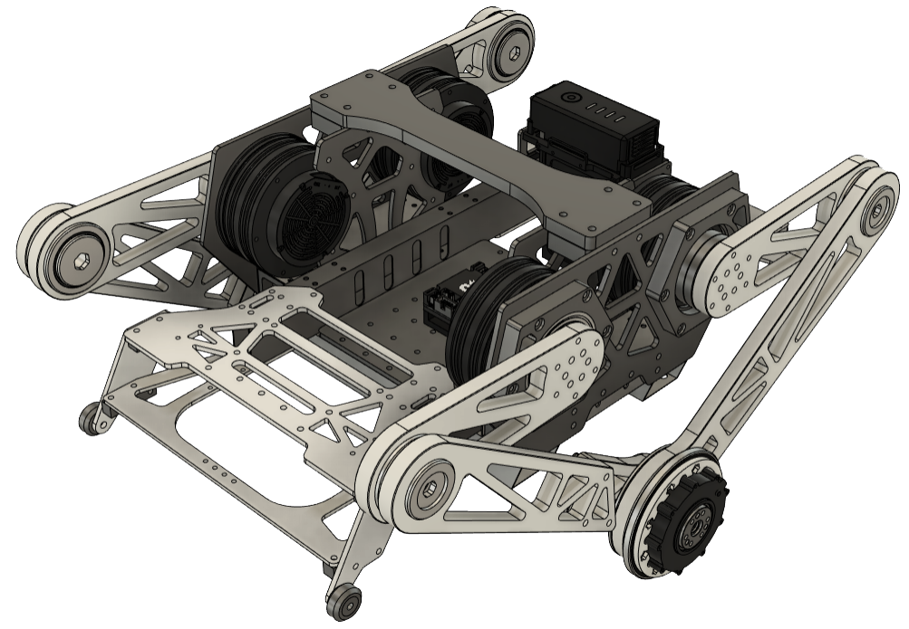

# **ZJUI-Balance-Infantry-Ver-2.0**

## 简介 Introduction

  

## 工具链配置
- Openocd (调试) + arm-none-eabi-gcc (交叉编译器) + MinGW (make 命令)
- Openocd 链接: https://gnutoolchains.com/arm-eabi/openocd/
- Openocd 安装: https://blog.csdn.net/u010058695/article/details/108864001
- eabi-gcc 链接: https://developer.arm.com/downloads/-/gnu-rm (2021年弃用) (参考 [META 战队文档](https://github.com/Meta-Team/Meta-Embedded/wiki/%E5%B7%A5%E5%85%B7%E9%93%BE-%E5%AE%89%E8%A3%85-Win#gcc-arm-none-eabi-%E7%9A%84%E5%AE%89%E8%A3%85%E5%8F%8A%E9%85%8D%E7%BD%AE))
- eabi-gcc 链接: [Arm GNU Toolchain Downloads – Arm Developer](https://developer.arm.com/downloads/-/arm-gnu-toolchain-downloads)
  - 下载 exe 文件
- MinGW-w64 参考: https://argvchs.netlify.app/2022/07/21/mingw-w64-install/ 
  - 记得把 bin 文件夹中的 mingw32-make.exe 改为 make.exe 
  - 否则需要输入 mingw32-make -v 才能在 cmd 中查看是否安装成功
### 知识介绍
- MinGW = Minimalist GNU for Windows
- OpenOCD = Open On-Chip Debugger
- eabi = Embedded Application Binary Interface

## 记录日志
- **2024.11.19 周二**
  - 完成平衡步兵底盘装配，等待关节电机 CAN 通信测试
  - 发现 arm_eabi-none-gcc 2021 年停止维护了?

## **Project Log**
- **2024.11.19 Tuesday**
  - complete assembling chassis, waiting for joint motors CAN communication test  

